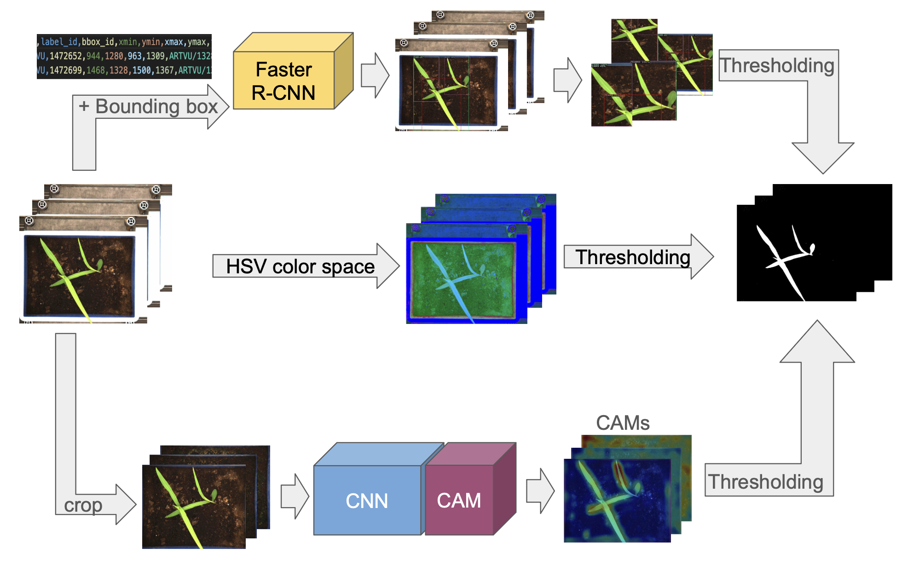
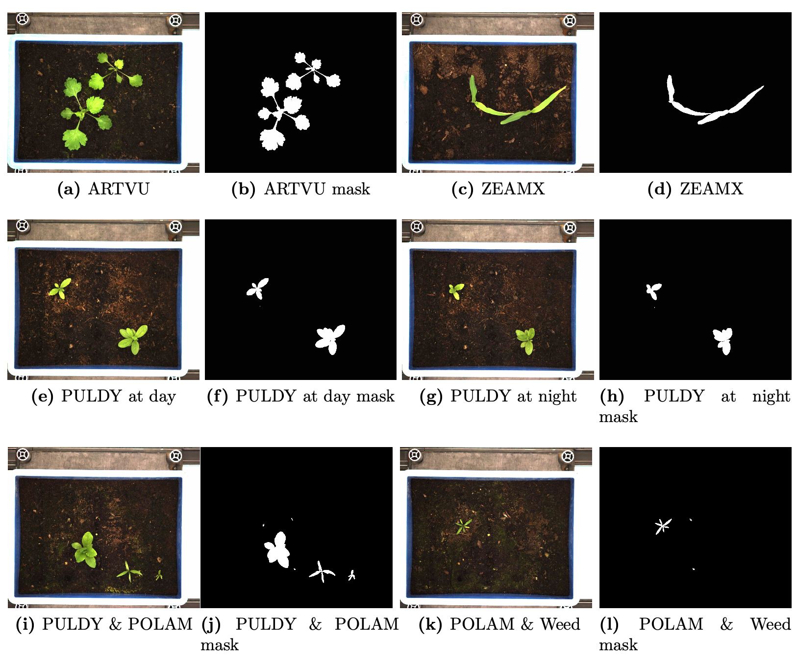
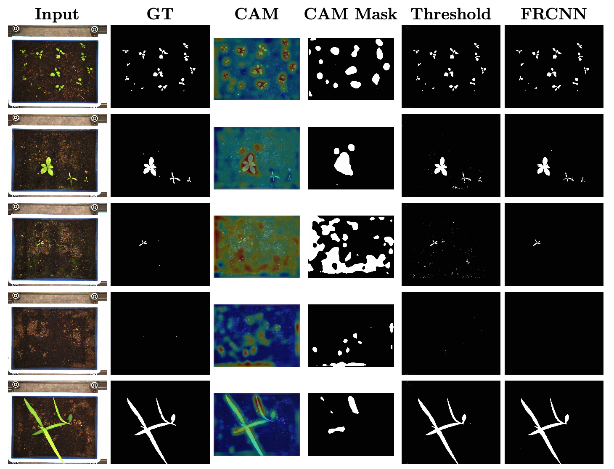

# Phenotyping of Greenhouse Imagery using Localization through Classification

This repository provides the source code for „Phenotyping of Greenhouse Imagery using Localization through Classification“. In this work, I explored Class Activation Mapping (CAM) by [Zhou et. Al](arXiv:1512.04150) on Greenhouse Imagery. This method that works under the paradigm of weakly supervised learning by performing localization through classification, instead of relying on localization information such as bounding boxes or semantic masks. Threshold-based segmentation  and Faster R-CNN with thresholding were implemented, as well to showcase the effects of localization performance on the availability of annotation data. The experiments show that thresholding generates fine-grain segmentation maps but cannot differentiate between phenotypes. CAM produces coarse-grain segmentation maps, with the ability to segment target species. Faster R-CNN with thresholding generates the most precise masks at the cost of additional annotation effort.

<p align="center">
    
</p>

**Figure 1**: Pipeline for segmentation. Refer to the method section in the thesis for more information.

<p align="center">
    
</p>

**Figure 2**: Example images from [MFWD](https://doi.org/10.1038/s41597-024-02945-6) used in this thesis. Refer to the method section in the thesis for more information.


## Results on the test set

|                Model |  F1 |   IoU |   mAP |
|---------------------:|----:|------:|------:|
|        Thresholding  |   - | 0.735 |     - |
|                 CAM  | 0.6 | 0.160 |     - |
|        Faster R-CNN  |   - | 0.806 | 37.10 |

**Table 1**: Comparison of all three models. Cells with ”-” means metric cannot be calculated. For more information refer to the Results section in the thesis.

<p align="center">
    
</p>

**Figure 3**: Prediction comparison of all models. The first row demonstrates the ability to locate multiple objects. The image in the second row includes PULDY (largest plant), POLAM (mid-sized plant) and Weed (smallest plant). Third row consist of POLAM and Weed. forth row has a very small ZEAMX plant. CAM highlights the background as important. In the last row, CAM locates the entire plant but segments only parts of the plant. The CAM method generates less precise masks than the other two models. Thresholding produces accurate maps but includes noise as seen in the third row.


## Usage Notes

### Dataset
The models are trained on 3 species labeled after their EPPO code: ARTVU, PULDY, ZEAMX. Faster R-CNN works under the COCO Format. CAM-based model and Thresholding-base Segmentation follow a specific folder structure. The images are sorted by sets then classes then tray number. Example is given here:
```bash
train_val_cam
|- train_set
|  |- ARTVU
|  |  |- 132802
|  |  | |- ARTVU_132802_2021Y08M02D_12H43M22S_img.jpeg
|  |  | |- ARTVU_132802_2021Y08M03D_12H58M19S_img.jpeg
|  |  | ...
|  |  |- 132802
|  |  ...
|  ...
|– val_set
|  |- ARTVU
... 
```

Exact trays used in this thesis. Incomplete bounding boxes, and outliers removed, except for Test PULDY:
```
# Training
> ARTVU: 132804,  132807,  132813,  132816,  132819,  132825, 132802,  132805,  132808,  132817,  132829, 132803,  132806,  132809,  132812,  132815

> PULDY: 114811, 114815, 114817, 114810, 114812, 114901

> ZEAMX: 127801, 127802, 127803, 127804, 127805, 127806, 127807, 127808, 127809, 127810, 127811, 127812, 127813, 127814, 127815, 127816, 127817, 127818, 127819, 127820, 127821, 127822, 127823, 127824, 127825, 127826, 127827, 127828, 127829, 127830, 127831, 127832, 127833, 127834, 127835, 127836, 127837, 139801, 139802, 139803, 139804, 139805, 139806, 139807, 139808, 139809, 139810, 139811, 139812, 139813, 139814, 139815, 139816, 139817, 139818, 139819, 139820, 139821, 139822, 139823, 139824, 139825, 139826, 139827, 139828, 139829, 139830, 139831, 139832, 139833, 139834, 139835, 139836, 139838

# Validation
> ARTVU: 132801
> PULDY: 114905
> ZEAMX: 139837

# Test
> ARTVU: 132811
> PULDY: 114904
> ZEAMX: 127838
```

## Run the Code

1. Install requirements
2. Make sure that PyTorch is compatible with detectron2. If version error occurs refer to this [github issue](https://github.com/vllm-project/vllm/issues/1453)

### To reproduce the results on the test set
1. run `cam_model/run_test_cam.py` to generate weighted F1, IoU, Class Activation Maps (CAMs) and segmentation masks with the pretrained ResNet-18 used in the thesis.
2. run `faster_rcnn/run_test_frcnn.py` to generate mAP and all AP variants, bounding boxes, segmentation mask with a pretrained Faster R-CNN ResNet-50 used in this thesis.
3. run `thresholding_segmentation/main_thresholding.py` to generate IoU and segmentation masks. Adjust accordingly to recreate the results on the validation set.

### reproduce trained models
1. run `cam_model/find_hyperparam_cam.py` to recreate the results of training and validation of the CAM-based model. All metrics and plots are saved in `cam_model/output_archive_cam`. The corresponding folder is named after their hyperparameters.
2. run `faster_rcnn/find_hyperparam_frcnn.py` to reproduce the results of training and validation of Faster R-CNN. All metrics, bounding boxes, plots are saved under `faster_rcnn/output_archive`. The corresponding folder is named after their hyperparameters.
3. run `faster_rcnn/generate_mask_v2.py` to generate IoU and segmentation masks for the validation set. To generate mask & IoU for different model, adjust this below:

```python
cfg.MODEL.WEIGHTS = "path/to/model_final.pth"
```